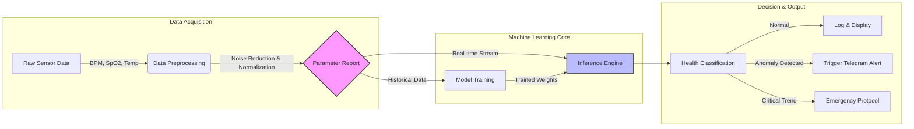

# HYGEIA 2.0 🏥✨
> **Next-Gen IoT Health Monitoring & Medication Management System**


## 📖 Overview

**HYGEIA 2.0** is an integrated healthcare ecosystem designed to bridge the gap between real-time patient monitoring and medication adherence. The system empowers caregivers and doctors by providing live vital statistics and ensuring timely medication delivery through automation.

The solution consists of two synchronized hardware nodes:
1.  **Smart Glove**: A wearable device that continuously monitors vital signs (Heart Rate, SpO2, Temperature) and detects emergencies.
2.  **MedSupply Unit**: An automated medicine dispenser that schedules doses and communicates with the glove to provide haptic medication reminders.

Additionally, the system features a **Machine Learning (ML)** component that analyzes generated **Parameter Reports** to predict health anomalies and trend deviations.

---

## 🏗 System Architecture

The system utilizes a hybrid communication model using **ESP-NOW** for low-latency device-to-device control and **WiFi** for cloud connectivity (Telegram/Web).

```mermaid
graph TD
    subgraph "Patient Node (Smart Glove)"
        Glove[ESP32 Smart Glove]
        Sensors[MAX30105 & DS18B20] -->|I2C/OneWire| Glove
        OLED[OLED Display] <--|I2C| Glove
        Vib[Vibration Motor] <--|GPIO| Glove
        Btn[Emergency Buttons] -->|GPIO| Glove
    end

    subgraph "Medication Node (MedSupply)"
        Med[ESP32 MedSupply Unit]
        Step[Stepper Motor] <--|Driver| Med
        WebSched[Web Scheduler] <..>|HTTP| Med
    end

    subgraph "Cloud & Analytics"
        Tele[Telegram Bot API]
        ML[Hygeia ML Engine]
        User[Caregiver / Doctor]
    end

    %% Data Flow
    Glove -- "ESP-NOW (Vibration Trigger)" --- Med
    Glove -- "WiFi (HTTPS)" --> Tele
    Tele -->|Alerts| User
    Med -- "NTP Sync" --> Internet((Internet))
    
    %% ML Flow
    Glove -.->|Parameter Report (CSV/Logs)| ML
    ML -.->|Predictive Insights| User
```

---

## 🧠 Hygeia-2.0 ML Workflow

The Machine Learning component is designed to move beyond simple threshold-based alerts. By training on the **Parameter Reports** generated by the sensors, the model identifies complex patterns in patient vitals.



---

## 🌟 Key Features

### 🧤 Smart Glove (Health Monitor)
*   **Vital Tracking**: Real-time monitoring of Heart Rate (BPM), Blood Oxygen (SpO2), and Skin Temperature.
*   **OLED Dashboard**: Displays live vitals, connection status, and last received messages.
*   **Emergency Response**: Physical buttons allow the patient to send specific distress messages to caregivers via Telegram.
*   **Haptic Medication Alerts**: Vibrates automatically when the MedSupply unit dispenses medicine.
*   **Web Server**: Hosts a local webpage for viewing vitals on a smartphone.

### 💊 MedSupply (Medicine Scheduler)
*   **Automated Dispensing**: Precision stepper motor control to dispense pills at user-defined intervals.
*   **Smart Scheduling**: Web-based interface to set, view, and reset medication timers.
*   **Synchronization**: Syncs time via NTP and triggers the Smart Glove's vibration motor via ESP-NOW when medication is dispensed.
*   **Stopwatch & Logs**: Tracks time since the last dose.

---

## 🛠 Hardware Requirements

| Component | Description |
| :--- | :--- |
| **ESP32 Dev Kit V1** | Main microcontroller (x2) |
| **MAX30105** | High-sensitivity Particle Sensor (HR/SpO2) |
| **DS18B20** | Waterproof Temperature Sensor |
| **OLED Display** | 1.3" SH1106 I2C Display |
| **Stepper Motor** | 28BYJ-48 with ULN2003 Driver |
| **Vibration Motor** | For haptic feedback |
| **Push Buttons** | For emergency triggers |

---

## 🚀 Setup & Configuration

### 1. Library Installation
Ensure the following libraries are installed in your Arduino IDE:
*   `WiFi`, `WebServer`, `esp_now` (Built-in)
*   `SparkFun MAX3010x Pulse and Proximity Sensor Library`
*   `DallasTemperature` & `OneWire`
*   `Adafruit GFX` & `Adafruit SH110X`
*   `UniversalTelegramBot`
*   `ArduinoJson`

### 2. MedSupply Configuration (`medsupply.ino`)
1.  Open `medsupply.ino`.
2.  **WiFi**: Set your AP password in `password`.
3.  **Pairing**: You must obtain the MAC Address of the Smart Glove (printed in Serial Monitor on boot) and paste it into:
    ```cpp
    uint8_t receiverMAC[] = {0xAA, 0xBB, 0xCC, 0xDD, 0xEE, 0xFF}; // Replace with Glove MAC
    ```

### 3. Smart Glove Configuration (`smartglove.ino`)
1.  Open `smartglove.ino`.
2.  **WiFi**: Enter your router credentials:
    ```cpp
    const char* WIFI_SSID = "REPLACE_WITH_WIFI_SSID";
    const char* WIFI_PASSWORD = "REPLACE_WITH_WIFI_PASSWORD";
    ```
3.  **Telegram**: Create a bot via BotFather and get your Token and Chat ID:
    ```cpp
    #define BOT_TOKEN "REPLACE_WITH_BOT_TOKEN"
    const char* CHAT_IDS[] = { "REPLACE_WITH_CHAT_ID" };
    ```

---

## 📊 Parameter Reports

The system generates data points used for the ML model. A typical parameter report entry includes:

| Timestamp | BPM | SpO2 (%) | Temp (°C) | Status |
| :--- | :--- | :--- | :--- | :--- |
| 10:00:05 | 72 | 98 | 36.5 | Normal |
| 10:00:10 | 115 | 94 | 37.1 | **Alert** |

---